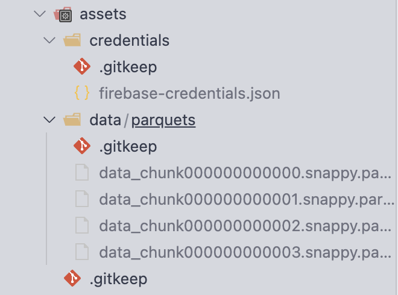

# Technical Interview For Sr Python Developer

---

## Levantar Ambiente

### Requisitos

* Java version > 17
* Python 3.9


### Instalación 

1. Clonar el repositorio, en la ruta clonada acceder a la carpeta <code>assets/data/parquets</code> y colocar los <code>.parquet</code> adjuntos en el instructivo de esta prueba. Adicionalmente colocar en la ruta <code>assets/credentials</code> el archivo adjunto `firebase-credentials.json`



2. Ingresar al directorio <code>api</code> y crear un ambiente virtual para los paquetes en python y activarlo

```bash 
$python3 -m virtualenv env

$source env/bin/activate
```

3. Instalar los requerimientos

```bash
$(env) pip3 install -r requirements.txt
```

4. Crear una copia del archivo `.env.template` y  nombrarlo `.env`, llenarlo con los datos especificados en el correo.

5. Run Microservicio (2 formas)

<code>productivo</code>
```bash
$(env) python main.py
```

<code>Server: http://127.0.0.1:8000</code>

<code>Desarrollo</code>
```bash
$(env) fastapi dev main.py
```

<code>Server: http://127.0.0.1:8000</code>

<code>Docker</code>
```bash
$docker build -t celes-test .
```

```bash
$docker run -d --name celestest -p 80:80 celes-test
```
<code>Server: http://127.0.0.1:80</code>

6. (Opcional) Run UnitTesting

```bash
$(env) pytest
```

### Next Steps

* [Arquitectura](docs/architecture.md)
* [Servicios/Api](docs/api.md)
